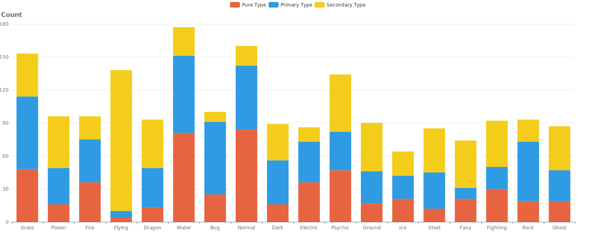
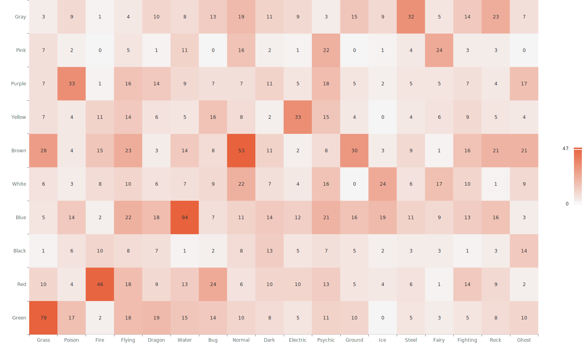
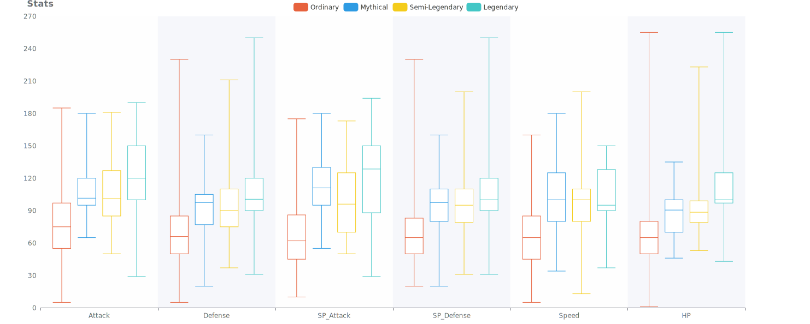
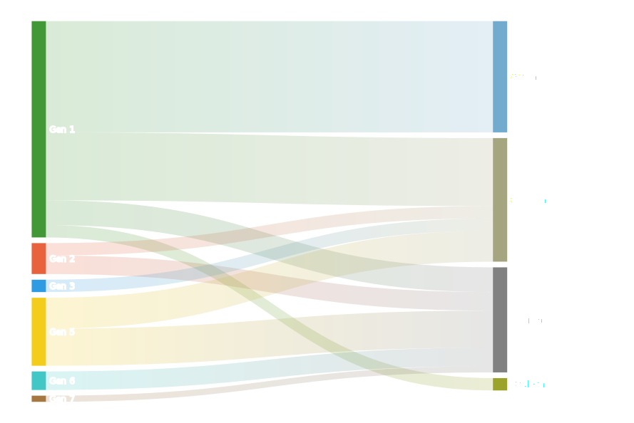
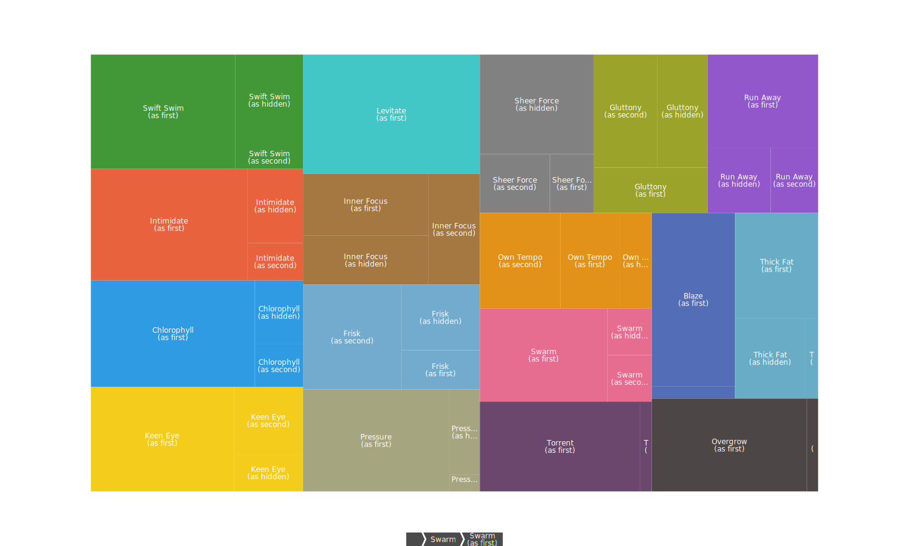
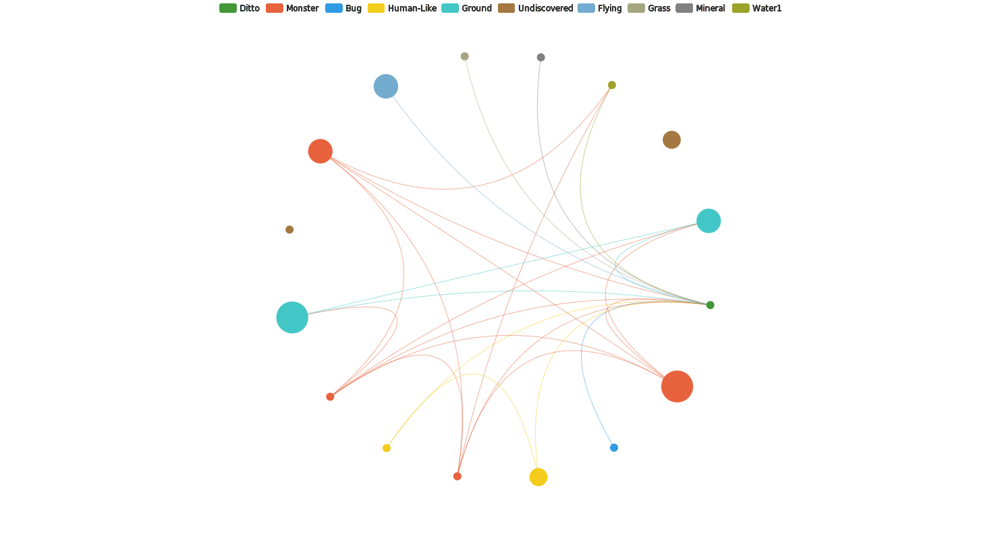
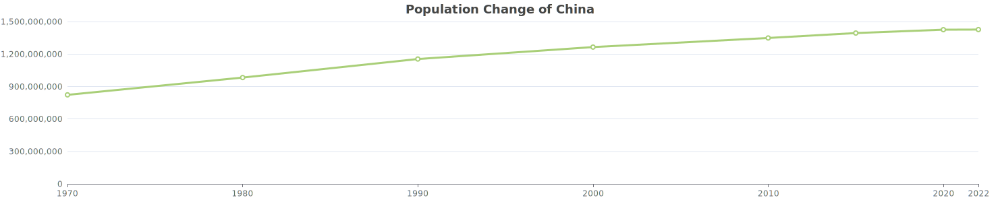
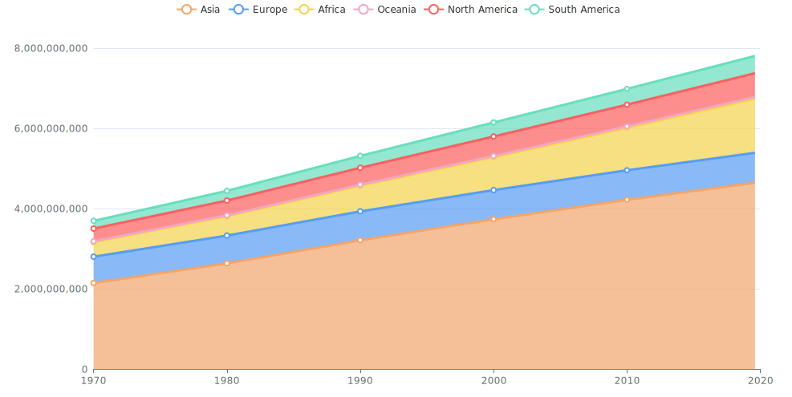
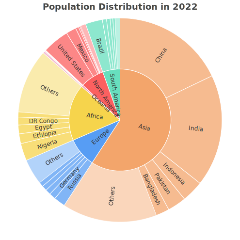

# Learn-Echarts
This is the project where I worked to learn `ECharts`. As a **Vue3** project, it features the **composition API**, **TypeScript** and **SCSS**. It also leverages **vue-echarts** to avoid directly operating on DOM, which is usually seen in ECharts tutorials but not recommended by Vue.

The project is available on [GitHub pages](https://sandhater.github.io/Learn-Echarts/).

I will be glad if this can also help you get familiar with the above tools as the example code.😄

## 📊 Examples of ECharts
The data visualization work has focused on two topics, covering various types of charts supported by `ECharts`.

### Pokémon
- **Bar chart:** the count of pokémons of each type.
    
- **Heat map:** the relationship between pokémons' colors and their types.
    
- **Box plot:** pokémons' stats distribution of different categories.
    
- **Sankey chart:** pokémons' generations when they were introduced and areas where there are their regional variants.
    
- **Tree map:** the top 17 common abilities.
    
- **Relation Graph:** whether two pokémons can breed, considering their egg groups and gender ratio.
    

### World Population
- **Geo map:** the population of countries/regions (data in several years available)
    
- **Line chart:** the population change of a country/region.
    
- **Stacked line chart:** the population change of six continents.
    
- **Sunburst chart:** the distribution of population in 2022.
    

## 🗃️ Source of Data
- The [Pokemon all 9 gen information](https://www.kaggle.com/datasets/ingmateleal/pokemon-all-9-gen-information) dataset on Kaggle
- The [World Population Dataset](https://www.kaggle.com/datasets/iamsouravbanerjee/world-population-dataset) on Kaggle
- The [world GeoJSON](https://echarts.apache.org/examples/data/asset/geo/world.json) from Echarts

⚠️ The dataset and GeoJSON files are not official or authoritative, and the accuracy of data is not guaranteed.

## 🛠️ Data Process Tools

### Loading CSV Dataset
I failed to find an elegant way to directly reading data from CSV files in TypeScript, without many third-party packages or complex configuration.

So, I write a Python script [csv_to_json.py](csv_to_json.py) to convert the CSV dataset into the JSON format first, which can be easily read in TypeScript. The original CSV datasets and their converted JSON files are all stored in the [data](src/data) directory.

If you want to use the Python Script, run

```shell
python csv_to_json.py --source <Source CSV Path> --target <Target JSON Path>
```

More arguments like `--delimeter`, `--new-line` are also supported.

### Structuring JSON Objects
Since the data structure is usually complex, operating with JSON objects may not be a good practice. I write the [jsonToObject.ts](src/utils/jsonToObject.ts), which offers the method to convert a JSON object to an object of defined class, according to keys in JSON and properties in class, so that you can leverage the power of TypeScript to organize the data items better.

## 🧩 Typical Code Structure
This project follows the typical structure of Vue3. The core code of data processing and visualization is in [PokemonPage.vue](src/pages/PokemonPage.vue) and [WorldPopulationPage.vue](src/pages/WorldPopulationPage.vue).

Options of `ECharts` are usually long, and processing data with TypeScript makes the `<script>` part even longer. So, I use the "region" annotation to split. IDEs like WebStorm that supporting this annotation can guide you to look through the code easier.